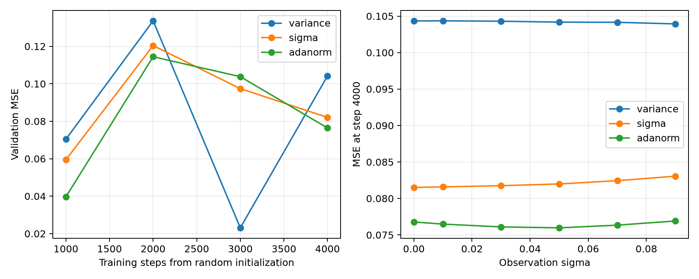

# 噪声注入从头训练筛选（2026-09-24）

用户已明确纠正：需要随机初始化、从头训练，不是从原始 checkpoint 微调。用户选择每组 4,000 步短程筛选。此要求取代此前交接文档中的微调下一步；之前 300 步微调的结果不回答当前问题。

## 对照协议

- 三组：归一化方差通道 `(sigma/0.09)^2`、归一化标准差通道 `sigma/0.09`、AdaNorm。
- 使用原 RMDM 的网络尺寸，但模型构造没有 checkpoint 参数、不读取任何预训练权重。公共主干采用相同随机种子和完全一致的随机初始张量。
- 通道组在共同随机主干上扩展两个输入卷积，新增列零初始化；AdaNorm 保留原 GroupNorm/BatchNorm，添加零初始化的噪声 scale/shift 分支。
- BatchNorm 从头更新统计量，全部有效参数参与优化；不使用冻结主干、冻结统计量或低噪声教师约束。
- 每组 4,000 步，batch 16，AdamW lr=1e-4，前 200 步线性 warmup，weight decay=0，梯度裁剪 1，BF16。每 1,000 步验证。
- 训练数据、采样与观测噪声分布、扩散目标、HWM 干净重建与 PINN 损失沿用当前 pipeline。
- 验证仅使用 val：采样率 1%/2%/3%，sigma=0/0.01/0.03/0.05/0.07/0.09，DDIM20，每条件 40 帧，batch 16。不使用 test。
- 主干随机 seed=20260924，新增模块 seed=20260925，训练顺序与扩散采样 seed=20260926。
- 训练与验证的采样 mask、观测噪声、扩散噪声及时间步统一在 CPU 生成；HWM Dropout2d 也使用 CPU 生成的通道 mask，再移至 GPU。首批样本 ID、mask 数量、sigma、时间步、噪声取值、共享初始权重均记录并跨机器核对。

## 实现与限制

入口：`experimental/rmdm_direct_noise/scratch.py`。不同 GPU/PyTorch 版本仍可能造成浮点计算差异；运行环境记录在各组 `metadata.json`。4,000 步是筛选预算，不代表充分收敛。首次 GPU 随机数版本发现同 seed 噪声不配对后已中止，不能混入正式 CPU 随机数配对结果。

状态与实际命令以 `.agents/runs/20260924_noise_scratch_screen.yaml` 为准。

## 完成结果

三组均完成 4,000 步，从随机初始化开始；未加载任何预训练权重。训练与验证过程检查均通过，最终条件消融也已完成。每组共处理 64,000 个训练样本实例。

固定 4,000 步比较，AdaNorm 平均 MSE 最低，比方差通道低 26.66%，比标准差通道低约 6.85%。但按各组最佳验证 checkpoint 比较，方差通道最低，排序发生反转。三组验证曲线均明显非单调；本轮不能证明某种注入方式稳定优于其余方案，也没有建立可靠的抗噪改进结论。

| 方案 | 第 4,000 步 MSE | 低噪声 MSE | 高噪声 MSE | 最佳验证 MSE | 最佳步数 |
|---|---:|---:|---:|---:|---:|
| 归一化方差通道 | 0.104205 | 0.104327 | 0.104084 | 0.023097 | 3000 |
| 归一化标准差通道 | 0.082053 | 0.081614 | 0.082492 | 0.059491 | 1000 |
| AdaNorm（GN/BN 调制） | 0.076429 | 0.076451 | 0.076406 | 0.039683 | 1000 |

低噪声为 sigma=0/0.01/0.03，高噪声为 sigma=0.05/0.07/0.09。所有数值均为验证集 DDIM20 MSE，越低越好。

### 完整验证曲线

| 方案 | 1,000 步 | 2,000 步 | 3,000 步 | 4,000 步 |
|---|---:|---:|---:|---:|
| 归一化方差通道 | 0.070428 | 0.133632 | 0.023097 | 0.104205 |
| 归一化标准差通道 | 0.059491 | 0.120403 | 0.097434 | 0.082053 |
| AdaNorm（GN/BN 调制） | 0.039683 | 0.114452 | 0.103810 | 0.076429 |

### 已知噪声条件消融

固定第 4,000 步权重和真实带噪观测，只将告知模型的 sigma 改为零。

| 方案 | 正确 sigma 的 MSE | 告知 sigma=0 的 MSE | 正确 sigma 相对改善 |
|---|---:|---:|---:|
| 归一化方差通道 | 0.104205 | 0.104970 | +0.73% |
| 归一化标准差通道 | 0.082053 | 0.082030 | -0.03% |
| AdaNorm（GN/BN 调制） | 0.076429 | 0.077318 | +1.15% |

这些差异仅为本次单 seed 的观测，未做显著性检验。最终 MSE 随 sigma 变化较小，但重建误差大且 checkpoint 表现波动，不能将平坦的噪声曲线当作抗噪成功。

### 解释范围

- 本轮是从头训练筛选，不是微调；之前的微调结果及低噪声退化百分比不适用于本轮结论。
- 未训练从头开始且不输入噪声水平的完整对照，因此不能单凭本轮证明噪声元数据优于不提供元数据。
- 4,000 步、batch 16、单 seed 是有限筛选预算。当前应先验证基础重建训练和 DDIM 质量是否稳定收敛，再据此确定注入方式。不同 GPU/PyTorch 的浮点运算差异仍属于限制。
- 训练/验证随机输入统一在 CPU 生成。三组正式运行首批的全部九项记录（样本、sigma、mask 数量、时间步、噪声取值、观测与目标总和、抽查共享初始权重）逐项一致。
- 没有使用测试集选择结构、超参数或 checkpoint；没有继续启动超出 4,000 步预算的训练。

### 产物与复现

- 训练源码 commit：`3680676024c3a29333694823fb0887951603ecf2`；条件消融入口：`experimental/rmdm_direct_noise/evaluate_scratch.py`（commit `815a9d8`）。
- 汇总入口：`experimental/rmdm_direct_noise/summarize_scratch.py`。
- 本地 AdaNorm checkpoint 与日志：`/data_p6/fzj/tmp/rmdm_noise_scratch_paired_20260924/adanorm`。
- Nice2 两种通道 checkpoint 与日志：`/data_16T_137/fzj/RMDM/runs/noise_scratch_paired_20260924/{variance,sigma}`。
- 三组 JSON 已整理到本地：`/data_p6/fzj/tmp/rmdm_noise_scratch_paired_20260924`。
- 归档：[汇总 JSON](artifacts/noise_scratch_screen_20260924/summary.json)、[逐条件 CSV](artifacts/noise_scratch_screen_20260924/conditions.csv)，同目录包含每组完整 metadata。
